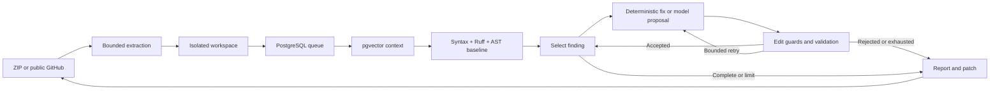

# Architecture and acceptance policy

The review uses real LangGraph nodes and conditional transitions. Explicit budgets and an additional finite graph recursion limit bound execution. Repository comments, filenames, documentation, and retrieved context are untrusted data; they cannot alter tools, limits, or edit paths.

## Acceptance policy

Each proposal targets one existing Python file and must match its original SHA-256. It cannot introduce imports, remove existing definitions, add check suppressions, or substantively modify tests. The replacement must parse, remove the selected file/rule issue, and introduce no new baseline findings. Rejected candidates are rolled back before further work.

Conservative Ruff fixes are limited to behavior-neutral textual rules and record static acceptance. Model-generated substantive edits additionally require passing baseline and candidate tests. The sandbox uses a fixed unittest command, no network, read-only root/source, dropped capabilities, no new privileges, a non-root user, bounded memory/CPU/process counts, and a bounded temporary filesystem. Timeouts trigger named-container cleanup. Submitted code never receives host credentials or the Docker socket.

Existing tests may be incomplete or adversarial. Passing them is evidence of compatibility, not proof of intended behavior. Unsupported or unverified corrections remain unresolved and appear in the report.

## Persistence and recovery

PostgreSQL stores metadata, workspace paths, status, timestamps, progress, and JSONB reports. Submissions are bounded under a transaction lock; `FOR UPDATE SKIP LOCKED` claims jobs atomically. A dedicated PostgreSQL advisory lock enforces one worker. Interrupted running jobs become failed at restart, avoiding silent repeated edits/provider calls.

Intake resolves a per-run provider policy. Automatic environment selection prefers Gemini and can snapshot an already configured OpenAI backup when `CODEPROOF_LLM_FALLBACK_ENABLED=true`. Explicit selections and BYOK reviews retain only their chosen provider and stay pinned. Native Gemini and OpenAI-compatible transports share the same single-file schema, budgets, deadlines, response-size limits and validation. Public metadata separates requested and actual provider/model, applicable effort, credential source, fixed fallback reasons/history, and shared provider-call counts. Keys live only in a locked in-memory settings vault before claim and in worker-local settings during the review. Success, failure, ownership loss and shutdown release those references. Queued BYOK jobs cannot recover their key after restart and fail safely; environment-backed jobs retain their recorded provider policy. Older queue rows without recorded provider choice recover without credentials, preventing newly added keys from silently activating old jobs.

Provider request errors use fixed text or numeric HTTP status, never response bodies. Fallback audit reasons use fixed availability codes, not provider response content. Gemini keys use an HTTP header, not a URL. Known Live/audio/image/embedding models are incompatible with code proposals. Browser overrides cannot change base URLs or enable a backup for pinned selections. Reports never include provider endpoints or secrets. Standalone HTML escapes all dynamic values, includes inline responsive/print styles, and has a restrictive content security policy with scripts disabled.

Output allowances scale with source size and are capped at 16000 tokens. Gemini receives at least 4096 tokens so native thinking and the structured full-file replacement can share a sufficient allowance; OpenAI-compatible requests receive at least 1024. Gemini's provider-default thinking settings remain unchanged. Prompt, response-byte, file-size, transport-time and global call limits remain independent guards.

Source chunks include run identity, path, line ranges, content, embedding method, and `vector(384)`. Retrieval scopes cosine-distance queries to the same run. Lexical hashing is deterministic and offline; future neural embeddings require explicit model/version/dimension metadata and compatible reindexing.

The initial checked-in SQL migration is idempotent. Future changes need explicit versioned migrations. There is no SQLite fallback; database or extension initialization failure stops startup.

## Stop policy

Defaults: three attempts per finding, twelve total attempts, six provider calls, twenty scheduled findings, and a 300-second review budget. Transport retries and backup requests count against the same global provider-call budget. Retry backoff is one second by default; numeric `Retry-After` values are capped at two seconds and cannot extend the review deadline. A fallback never resets calls, remediation attempts, seen proposals, or the review deadline. Unchanged and duplicate proposals stop that finding. Network and tool operations have additional timeouts; bounded cleanup can add a few seconds after the review deadline.

Automatic environment reviews permit at most one sticky Gemini-to-OpenAI transition after bounded retries for HTTP 401/403/404/429/5xx, network failures, or timeouts. After that transition, OpenAI remains selected for the rest of the review; there is no return to Gemini and no fallback loop. The backup must already have compatible server configuration and credentials. Explicit provider/model selections and BYOK reviews never fallback. Refusals, malformed/unsafe model outputs, schema/hash/path/credential/edit guard failures, expired deadlines, and exhausted budgets terminate within the original policy instead of activating the backup. The model output is subject to the same validation regardless of which provider returned it.

Intake separately limits compressed/expanded sizes, file counts, path depth, compression ratio, redirects, duration, and concurrent uploads. Indexing has a finite chunk cap. Queue polling is application lifecycle work; remediation loops are finite.
