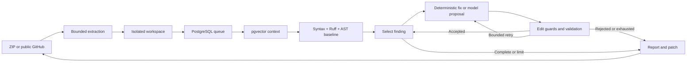

# Architecture and acceptance policy

The review uses real LangGraph nodes and conditional transitions. Explicit budgets and an additional finite graph recursion limit bound execution. Repository comments, filenames, documentation, and retrieved context are untrusted data; they cannot alter tools, limits, or edit paths.

## Acceptance policy

Each proposal targets one existing Python file and must match its original SHA-256. It cannot introduce imports, remove existing definitions, add check suppressions, or substantively modify tests. The replacement must parse, remove the selected file/rule issue, and introduce no new baseline findings. Rejected candidates are rolled back before further work.

Conservative Ruff fixes are limited to behavior-neutral textual rules and record static acceptance. Model-generated substantive edits additionally require passing baseline and candidate tests. The sandbox uses a fixed unittest command, no network, read-only root/source, dropped capabilities, no new privileges, a non-root user, bounded memory/CPU/process counts, and a bounded temporary filesystem. Timeouts trigger named-container cleanup. Submitted code never receives host credentials or the Docker socket.

Existing tests may be incomplete or adversarial. Passing them is evidence of compatibility, not proof of intended behavior. Unsupported or unverified corrections remain unresolved and appear in the report.

## Persistence and recovery

PostgreSQL stores metadata, workspace paths, status, timestamps, progress, and JSONB reports. Submissions are bounded under a transaction lock; `FOR UPDATE SKIP LOCKED` claims jobs atomically. A dedicated PostgreSQL advisory lock enforces one worker. Interrupted running jobs become failed at restart, avoiding silent repeated edits/provider calls.

Intake resolves an immutable per-run provider configuration. Native Gemini and OpenAI-compatible transports share the same single-file schema, budgets, deadlines, response-size limits and validation. Public metadata includes the provider/model/applicable effort and credential source. Keys live only in a locked in-memory settings vault before claim and in worker-local settings during the review. Success, failure, ownership loss and shutdown release those references. Queued BYOK jobs cannot recover their key after restart and fail safely; environment-backed jobs retain their recorded provider/model. Older queue rows without recorded provider choice recover without credentials, preventing newly added keys from silently activating old jobs.

Provider request errors use fixed text or numeric HTTP status, never response bodies. Gemini keys use an HTTP header, not a URL. Known Live/audio/image/embedding models are incompatible with code proposals. Browser overrides cannot change base URLs. Reports never include provider endpoints or secrets. Standalone HTML escapes all dynamic values, includes inline responsive/print styles, and has a restrictive content security policy with scripts disabled.

Source chunks include run identity, path, line ranges, content, embedding method, and `vector(384)`. Retrieval scopes cosine-distance queries to the same run. Lexical hashing is deterministic and offline; future neural embeddings require explicit model/version/dimension metadata and compatible reindexing.

The initial checked-in SQL migration is idempotent. Future changes need explicit versioned migrations. There is no SQLite fallback; database or extension initialization failure stops startup.

## Stop policy

Defaults: three attempts per finding, twelve total attempts, six provider calls, twenty scheduled findings, and a 300-second review budget. Each provider proposal has at most two transport requests, counted against the same global call budget. Unchanged and duplicate proposals stop that finding. Network and tool operations have additional timeouts; bounded cleanup can add a few seconds after the review deadline.

Rate limits, quota exhaustion and provider outages do not trigger an automatic provider/model fallback. The user can explicitly choose another provider on a new submission; this avoids silent changes in data destination and credentials.

Intake separately limits compressed/expanded sizes, file counts, path depth, compression ratio, redirects, duration, and concurrent uploads. Indexing has a finite chunk cap. Queue polling is application lifecycle work; remediation loops are finite.
